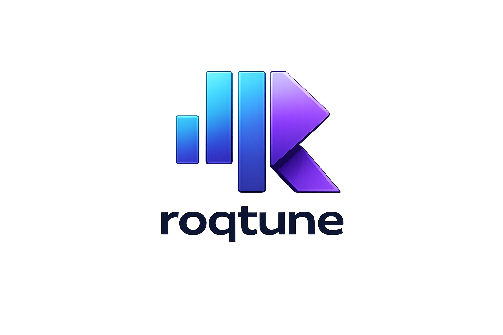
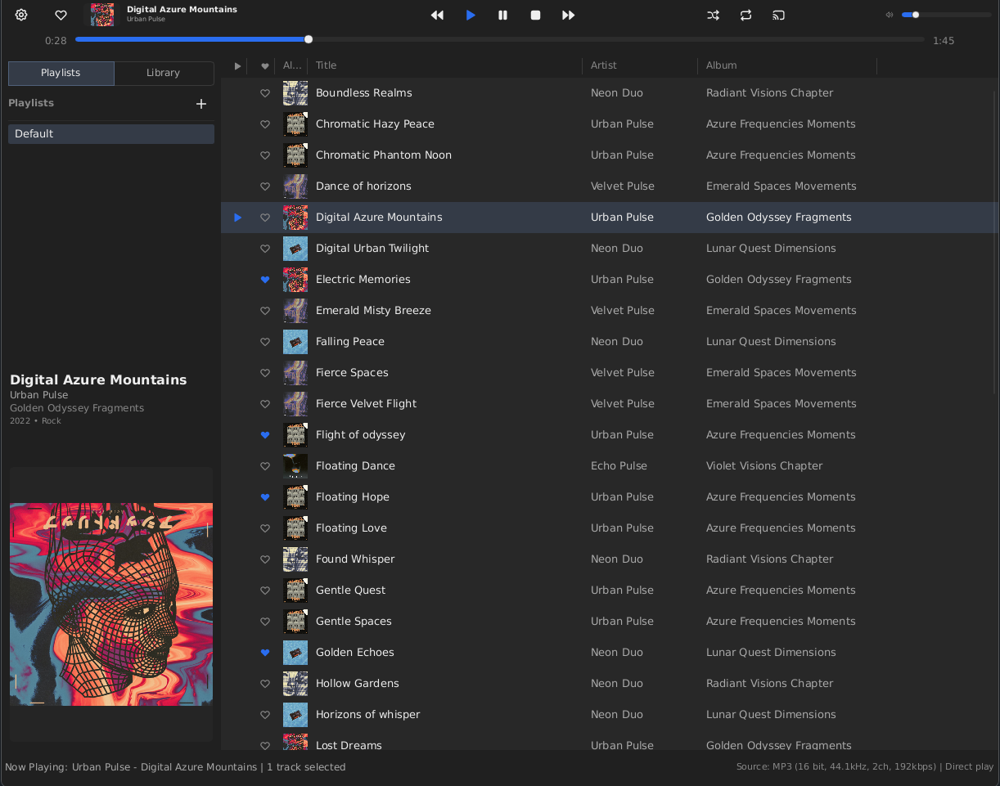
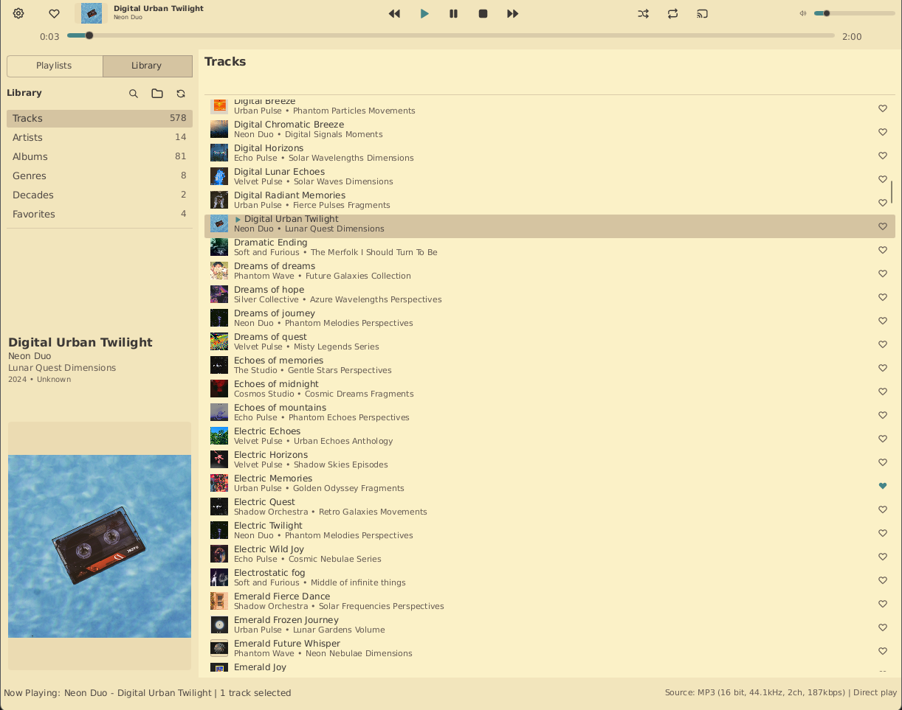

# roqtune

`roqtune` is a desktop music player that aims to bring back the fun of curating and enjoying your personal music library. It is designed to be highly customizable, feature rich, and performant. It is written in Rust and uses the cross platform Slint UI framework.

<figure>
  
  <figcaption><em>Playlist mode (Default Theme)</em></figcaption>
</figure>
<figure>
  
  <figcaption><em>Library mode (Gruvbox Light Theme)</em></figcaption>
</figure>

## Features

- Fully customizable UI with a live layout editor (modular panels, split/resize, undo/redo, persistent `layout.toml`)
- Power-user playlist mode: sortable + filterable track table, multi-select, drag-reorder, and robust clipboard workflows (copy/cut/paste across playlists and from library)
- Rich library browsing with fast scanning and views for Tracks, Albums, Artists, Genres, Decades, and Favorites
- Album/artist detail pages with optional internet enrichment (bios, images, descriptions) plus manual override tools
- Advanced track properties & tag editing including embedded artwork replace/remove and media info inspection
- High-quality playback engine (seek, queue, shuffle/random, repeat modes, crossfade)
- Audio fidelity controls including ReplayGain, resampling quality, output device/sample rate/bit-depth/channel options
- Theming + custom colors: switch between curated color schemes or fine-tune your own palette (with per-component color editing)
- Integrations: OpenSubsonic streaming (multi-profile) and local network casting support

## Project Status

- Project is in early development, and is roughly alpha quality. Major functionality is working but some bugs, especially visual, are still to be expected.
- Only linux is supported currently, though the project is being built cross platform, since that's what I'm able to test at the moment.

## Quick Start

Detailed installation and packaging instructions live in [`INSTALL.md`](INSTALL.md).

### Prerequisites

- Rust toolchain with Cargo (`rustup` recommended)

### Build and Run

- Debug build: `cargo build`
- Run app (unoptimized debug version): `cargo run`
- Release build: `cargo build --release`
- Run release: `cargo run --release`
- Fast compile check: `cargo check`

### Tests and Quality

- Run all tests: `cargo test --locked`
- Run tests with output: `cargo test -- --nocapture`
- Format code: `cargo fmt`
- Format check (CI parity): `cargo fmt --all --check`
- Lint (deny warnings): `cargo clippy --all-targets --locked -- -D warnings`

## Keyboard Shortcuts

- Standard cut, copy, paste shortcuts (`Ctrl+X`, `Ctrl+C`, `Ctrl+V`)
- `F6` or `Ctrl+L`: toggle layout editor mode
- `Delete`: delete selected tracks (or active playlist when sidebar is focused)
- `F2`: rename active playlist
- `Escape`: close menus/dialogs and exit layout editor mode

## Architecture Overview

The app is organized into cooperating runtime components connected through an event bus (`tokio::sync::broadcast`):

- `src/protocol.rs`: shared message protocol for all components.
- `src/main.rs`: binary entrypoint and top-level module wiring.
- `src/app_runtime.rs`: startup/config bootstrap and runtime initialization.
- `src/app_bootstrap/services.rs`: background worker/service spawning.
- `src/app_callbacks/*`: Slint callback registration by feature area.
- `src/runtime/audio_runtime_reactor.rs`: runtime config/device event coordination.
- `src/audio/*`: decode, playback, output probing, and output option selection.
- `src/playlist/*`: playlist data model and playlist orchestration.
- `src/library/*`: library scanning/indexing and enrichment.
- `src/metadata/*`: tag parsing and metadata orchestration.
- `src/integration/*`: backend/integration management (including OpenSubsonic).
- `src/cast/*`: cast manager and cast playback control.
- `src/ui_manager.rs`: bus-to-UI state synchronization and UI-side orchestration.
- `src/layout.rs`: layout tree model and edit operations.
- `src/config.rs` + `src/config_persistence.rs`: config model and comment-preserving persistence.
- `src/db_manager.rs`: SQLite persistence for playlists, library index/cache data, and UI metadata.

## Data and Config Files

`roqtune` stores files in OS-appropriate user directories via the `dirs` crate.

- Config file: `<config_dir>/roqtune/config.toml`
- UI Layout file: `<config_dir>/roqtune/layout.toml`
- App-state database (SQLite 3): `<data_dir>/roqtune/roqtune.db`
- Cover art cache root: `<cache_dir>/roqtune/covers/`
  - Originals: `<cache_dir>/roqtune/covers/original/`
  - List thumbs: `<cache_dir>/roqtune/covers/thumbs/<max_edge_px>/`
  - Detail previews: `<cache_dir>/roqtune/covers/detail/<max_edge_px>/`
- Artist image cache root: `<cache_dir>/roqtune/library_enrichment/`
  - Originals: `<cache_dir>/roqtune/library_enrichment/images/`
  - List thumbs: `<cache_dir>/roqtune/library_enrichment/thumbs/<max_edge_px>/`
  - Detail previews: `<cache_dir>/roqtune/library_enrichment/detail/<max_edge_px>/`
- Output probe cache: `<cache_dir>/roqtune/output_probe_cache.json`

Common Linux defaults:

- `~/.config/roqtune/config.toml`
- `~/.config/roqtune/layout.toml`
- `~/.local/share/roqtune/roqtune.db`
- `~/.cache/roqtune/covers/`

System templates in this repo:

- `config/config.system.toml` (copy to `~/.config/roqtune/config.toml` and edit)
- `config/layout.system.toml` (copy to `~/.config/roqtune/layout.toml` and edit)

## UI Development

- Main UI file: `src/roqtune.slint`
- Reusable UI parts: `src/ui/components/*.slint`
- Shared UI model types: `src/ui/types.slint`

## AI Disclosure
- The core event bus architecture, technology choices, and initial implementation were created by hand with minimal AI input
- AI agents were heavily used for feature implementations, resulting in enormous time / effort savings over what I could do by hand

## Attributions
See [ATTRIBUTIONS.md](ATTRIBUTIONS.md) for third-party license information.
